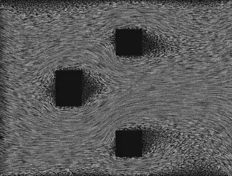
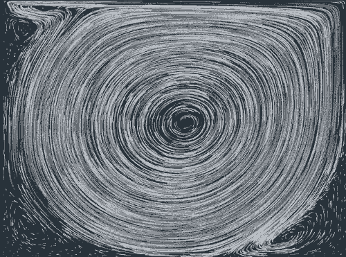

# Fluid Simulation

> Poiseuille flow


> lid-driven cavity


## Performance per frame
render size: full screen on iPhone, 1600px x 1200px on macOS.

#### Poiseuille flow with 100 * 75 lattice

Device | OS Version | FPS | CPU cost  | GPU frame time
--------- | --------- |  --------- | ------------- | -------------
MBP 2018 (15-inch, i7, AMD Radeon Pro 560X) | macOS 10.15.1 | 60 | 17%  | 3.8ms
MBP 2018 (15-inch, i7, Intel(R) UHD Graphics 630) | macOS 10.15.1 | 60 |  21%  | 2.3ms
iPhone 6 plus  | iOS 12.4.3 | 60 | 80% | 13.5ms
iPhone Xs Max  | iOS 13.2.3 | 60 | 54% | 6.3ms
iPad Pro (11-inch)  | iOS 13.1.3 | 120 | 83% | 5.4ms

## Run 
```sh
# on macOS
# run poiseuille flow
cargo run --example fluid poiseuille
# run lid-driven cavity 
cargo run --example fluid lid_driven_cavity

# build for iOS
cargo build --target aarch64-apple-ios

# run on iOS device
cd iOS
pod install
# then use Xcode to open fluid_demo.xcworkspace
```

